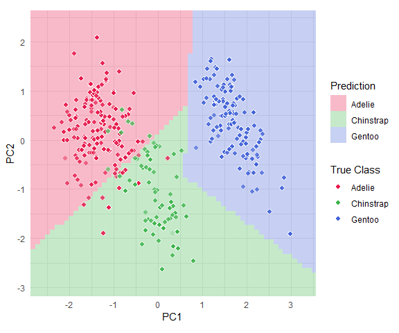

<!-- README.md is generated from README.Rmd. Please edit that file -->

# classbound

<!-- badges: start -->

[](https://github.com/natydasilva/classbound/actions/workflows/R-CMD-check.yaml)
[](https://github.com/natydasilva/classbound/actions/workflows/pkgdown.yaml)
<!-- badges: end -->

The **classbound** package provides tools to explore, visualize, and
analyze classification decision boundaries in R. It offers a unified
interface for fitting machine learning models and rendering 2D
visualizations of their prediction surfaces.

## Installation

You can install the development version of classbound from GitHub with:

``` r
# install.packages("devtools")
devtools::install_github("natydasilva/classbound")
```

## Quick Start

### Visualizing a Decision Boundary

Here is a basic example of how to fit a model and visualize its decision
boundary:

``` r
library(classbound)
library(palmerpenguins)

# 1. Load and prepare sample dataset
penguins <- na.omit(penguins[, -c(2, 7, 8)])

# 2. Fit a decision tree (rpart) predicting species
model <- fit_model(
  data = penguins,
  formula = species ~ bill_length_mm + bill_depth_mm,
  classifier = rpart::rpart,
  interface = "formula"
)

# 3. Compute the boundary
feature_range <- list(
  bill_length_mm = c(30.0, 60.0),
  bill_depth_mm = c(10.0, 25.0)
)
grid_data <- boundary_compute(model, range = feature_range, resolution = 100)

# 4. Plot the decision boundary
plot_boundary(
  boundary = grid_data,
  obs_data = penguins,
  x_col = "bill_length_mm",
  y_col = "bill_depth_mm",
  true_label = "species"
)
```



### The All-In-One Wrapper

For convenience, you can perform fitting, boundary computation, and
plotting in a single step using the `classbound()` wrapper:

``` r
classbound(
  data = penguins,
  formula = species ~ bill_length_mm + bill_depth_mm,
  classifier = rpart::rpart,
  resolution = 100
)
```

### Using Different Classifiers

Because `classbound` uses standard R evaluation, you can easily plug in
other models. The package supports different classifier interfaces
(`formula`, `matrix`, `custom`):

``` r
# Formula interface (e.g., SVM)
model_svm <- fit_model(penguins, species ~ bill_length_mm + bill_depth_mm, e1071::svm)

# Custom interface (e.g., qeKNN from qeML where formula is not supported)
model_knn <- fit_model(
  data = penguins,
  formula = species ~ bill_length_mm + bill_depth_mm,
  classifier = qeML::qeKNN,
  interface = "custom",
  fit_args = list(data = penguins, yName = "species", k = 25)
)
```

### Interactive Exploration

The package also includes a Shiny app to interactively explore models
and boundaries. You can launch it using:

``` r
explorapp()
```
