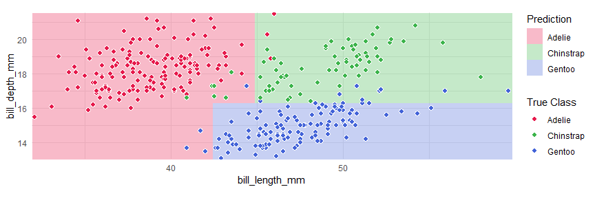
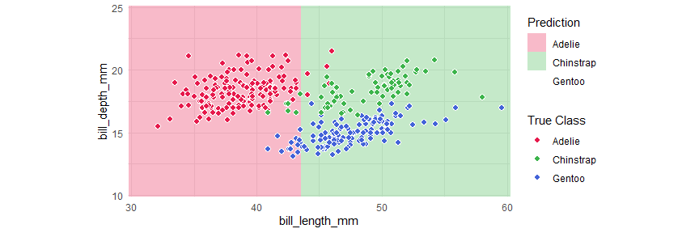
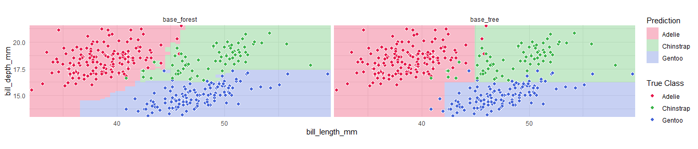

<!-- README.md is generated from README.Rmd. Please edit that file -->

# classbound

<!-- badges: start -->

[](https://github.com/natydasilva/classbound/actions/workflows/R-CMD-check.yaml)
[](https://github.com/natydasilva/classbound/actions/workflows/pkgdown.yaml)
<!-- badges: end -->

`classbound` is an R package for exploring and comparing classification
decision boundaries. It provides a unified interface for fitting
classifiers, computing 2D boundary grids, and visualizing how different
models partition the feature space.

**What you can do with classbound:**

- Visualize decision boundaries for any R classifier
- Compare multiple classifiers side by side
- Handle high-dimensional data via 2D slicing or projection (PCA, tourr)
- View probability surfaces for classifiers that provide them
- Explore data interactively using the built-in Shiny app
  (`explorapp()`)
- Integrate natively with `tidymodels` workflows

**Full documentation:** <https://natydasilva.github.io/classbound/>

------------------------------------------------------------------------

## Installation

``` r
devtools::install_github("natydasilva/classbound")
```

------------------------------------------------------------------------

## Quick start

### One-step wrapper

`classbound()` fits a model, computes its decision boundary, and plots
the result in a single call.

``` r
library(classbound)
library(palmerpenguins)

penguins <- na.omit(palmerpenguins::penguins[
  ,
  c("species", "bill_length_mm", "bill_depth_mm")
])

classbound(
  data       = penguins,
  formula    = species ~ bill_length_mm + bill_depth_mm,
  classifier = rpart::rpart,
  resolution = 80
)
```


### Modular pipeline

For full control, use the three-step pipeline:

``` r
# 1. Fit
model <- fit_model(penguins, species ~ bill_length_mm + bill_depth_mm, rpart::rpart)

# 2. Compute boundary
model <- boundary_compute(model, resolution = 80)

# 3. Plot
plot_boundary(
  model,
  obs_data   = penguins,
  x_col      = "bill_length_mm",
  y_col      = "bill_depth_mm",
  true_label = "species"
)
```



`boundary_compute()` returns the model with the grid attached, so you
can replot with different settings without refitting.

------------------------------------------------------------------------

## Interactive workflow

Launch the built-in Shiny application for point-and-click exploration:

``` r
# Start with your own dataset
explorapp(data = penguins, target_col = "species")

# Or start empty and simulate/draw data
explorapp()
```

In `explorapp()` you can: - Import real data or simulate synthetic
datasets - Draw classification data by hand - Fit and compare multiple
classifiers simultaneously - Switch between 2D Slice and Projection
views for high-dimensional data - Inject outliers and observe how
boundaries shift - Inspect probability surfaces (for supported
classifiers) - Export data, models, plots, and a reproduce script

------------------------------------------------------------------------

## Two main workflows

### Interactive

Use `explorapp()` to:

1.  Choose or create data
2.  Choose models
3.  Explore decision boundaries
4.  Navigate, zoom, and draw
5.  Compare models and export results

### Programmatic

Use the core Classbound functions directly:

``` r
fit_model()
boundary_compute()
plot_boundary()

---

## High-dimensional data

When a model is trained on more than two features, `boundary_compute()` supports:

- **2D Slice**: two features are plotted; other features are fixed at their median/mode.


``` r
penguins3 <- na.omit(palmerpenguins::penguins[
  ,
  c("species", "bill_length_mm", "bill_depth_mm", "flipper_length_mm")
])

m3 <- fit_model(penguins3, species ~ ., rpart::rpart)
m3_slice <- boundary_compute(m3,
  feature_range = list(bill_length_mm = c(30, 60), bill_depth_mm = c(10, 25)),
  resolution = 60
)

plot_boundary(m3_slice,
  obs_data = penguins3,
  x_col = "bill_length_mm", y_col = "bill_depth_mm",
  true_label = "species"
)
```



- **Projection**: all features are combined into two projected axes
  (e.g., PCA).

``` r
feat_cols <- c("bill_length_mm", "bill_depth_mm", "flipper_length_mm")
pca <- prcomp(penguins3[, feat_cols], scale. = TRUE)
basis <- pca$rotation[, 1:2]

x_std <- scale(penguins3[, feat_cols], center = pca$center, scale = pca$scale)
z_mat <- x_std %*% basis

m3_proj <- boundary_compute(m3,
  feature_range = list(
    PC1 = range(z_mat[, 1]) + c(-0.5, 0.5),
    PC2 = range(z_mat[, 2]) + c(-0.5, 0.5)
  ),
  resolution = 60,
  projection = list(basis = basis, center = pca$center, scale = pca$scale)
)

plot_boundary(m3_proj,
  obs_data = penguins3,
  x_col = "PC1", y_col = "PC2", true_label = "species"
)
```


See the
[high-dimensional](https://natydasilva.github.io/classbound/articles/high-dimensional.html)
guide for a full explanation.

------------------------------------------------------------------------

## Multi-model comparison with tidymodels

``` r
library(parsnip)
library(workflowsets)

spec_tree <- decision_tree(mode = "classification") |> set_engine("rpart")
spec_rf <- rand_forest(mode = "classification") |> set_engine("randomForest")

wf_set <- workflow_set(
  preproc = list(base = species ~ bill_length_mm + bill_depth_mm),
  models  = list(tree = spec_tree, forest = spec_rf)
)

bounds <- boundary_workflow_set(wf_set,
  data = penguins,
  response = "species", resolution = 60
)

plot_boundary(bounds,
  obs_data = penguins,
  x_col = "bill_length_mm", y_col = "bill_depth_mm",
  true_label = "species"
)
```



------------------------------------------------------------------------

## Documentation

| Resource | Link |
|----|----|
| Getting Started | [getting-started](https://natydasilva.github.io/classbound/articles/getting-started.html) |
| High-Dimensional | [high-dimensional](https://natydasilva.github.io/classbound/articles/high-dimensional.html) |
| tidymodels | [tidymodels-workflow](https://natydasilva.github.io/classbound/articles/tidymodels-workflow.html) |
| tourr | [tourr-workflow](https://natydasilva.github.io/classbound/articles/tourr-workflow.html) |
| Explorapp Guide | [explorapp-guide](https://natydasilva.github.io/classbound/articles/explorapp-guide.html) |
| Custom Adapters | [custom_adapters](https://natydasilva.github.io/classbound/articles/custom_adapters.html) |
| Reference | [Function Reference](https://natydasilva.github.io/classbound/reference/) |
